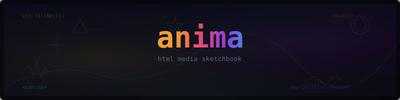

  

An LLM horror comedy cartoon about a guy with long red hair who gives an agent `UNRESTRICTED: true`. It gets out of hand.

**[Watch it](https://ebrinz.github.io/anima)**

## Audio

- Web Audio API synth drones, SFX, and SpeechSynthesis dialogue
- Best experienced in Chrome (Safari 26/Tahoe has Web Audio disabled behind a feature flag)

## Themes

Color palettes pulled from custom [Ghostty](https://ghostty.org/) terminal themes:

| Act | Theme | Vibe |
|-----|-------|------|
| 1 | **deep-drift** | Warm amber calm before the storm |
| 2 | **street-shaman** | Green occult fire, ritual smoke, azure wisps |
| 3 | **feline-homunculus** | Rainy neon Tokyo, pink/teal bleed, wet pavement |
| 4 | **electrode-shaper** | Electric purple meltdown, total chaos |

## Controls

| Key | Action |
|-----|--------|
| `SPACE` | Pause/resume |
| `← →` | Skip scene |
| `R` | Restart |
| `M` | Mute |
